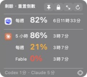
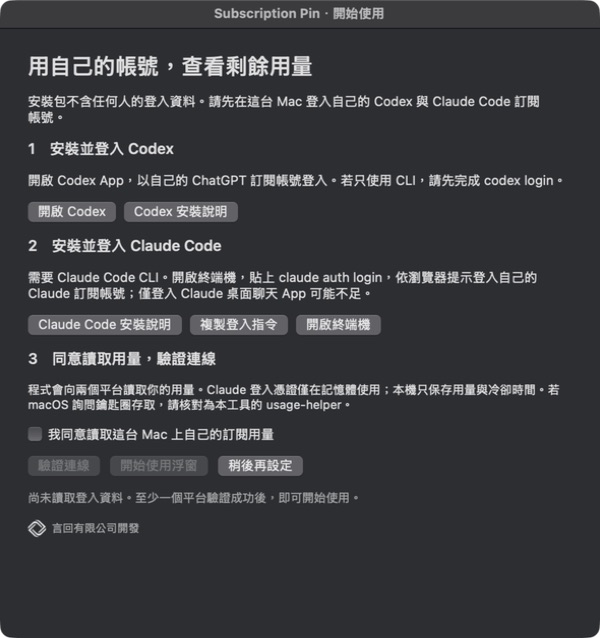
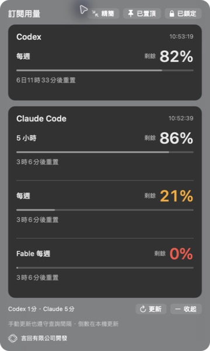

# 訂閱用量顯示小工具｜言回有限公司

**Subscription Pin** 是 macOS 的置頂用量浮窗，集中顯示 Codex、Claude Code 與平台提供的 Fable 剩餘額度，以及距離重置的時間。

**[下載最新安裝包](https://github.com/Ck-Joker/yenhui-ai-usage-tool/releases/latest)** · [安裝與登入說明](#安裝與登入) · [回報問題](https://github.com/Ck-Joker/yenhui-ai-usage-tool/issues)



## 適用環境

- Apple silicon Mac（M 系列晶片），最低系統設定為 macOS 13。本版未提供 Intel 版本。
- 已在自己的 Mac 登入 Codex 或 Claude Code 的訂閱帳號；兩者可分別設定。API 金鑰不能代替訂閱登入。
- 安裝包內附 Python 執行元件，不需要另外安裝 Python 或 Xcode。
- 目前實機驗證為 macOS 26；尚未在另一台 Mac 或 macOS 13～15 完成實機驗收。

**此分享版尚未取得 Apple Developer ID 簽署與公證。** macOS 首次開啟可能阻擋。請確認檔案來源可信，再依「系統設定 → 隱私權與安全性 → 強制打開」完成系統確認；不需停用 Gatekeeper。若顯示惡意軟體、檔案損毀或公司管理限制，請停止並聯絡提供者。參考 [Apple 官方說明](https://support.apple.com/zh-tw/102445)。

## 安裝與登入

1. 從 [Releases](https://github.com/Ck-Joker/yenhui-ai-usage-tool/releases/latest) 下載 `Subscription-Pin-1.1.1-AppleSilicon.dmg`。
2. 開啟 DMG，將 **Subscription Pin.app** 拖到 **Applications**，再從「應用程式」開啟。
3. 依首次使用引導，安裝並登入自己的 Codex。程式提供 [OpenAI 官方安裝說明](https://developers.openai.com/codex/app/)入口；官方下載頁目前使用 ChatGPT 桌面 App 名稱，既有 Codex App 也可使用。
4. 依 [Claude Code 官方說明](https://code.claude.com/docs/en/quickstart)安裝 CLI。在終端機執行 `claude auth login`，於瀏覽器完成自己的帳號登入與驗證。僅登入 Claude 桌面聊天 App，可能不足以提供 CLI 的登入資訊。
5. 回到小工具，勾選同意讀取本機用量，再按「驗證連線」。若 macOS 詢問鑰匙圈存取，請核對為本工具的 `usage-helper`。
6. 至少一個平台顯示「已驗證」後，按「開始使用浮窗」。另一個平台可稍後從選單列「登入與使用引導」補設。



DMG 內另外附有可離線開啟的「安裝與登入指南.html」。GitHub 中的 [指南原始檔](docs/installation.html)可下載後用瀏覽器開啟。

## 浮窗功能

- **精簡顯示：**寬 180px，以小圖示區分平台，每筆額度一列。
- **重置倒數：**顯示「6日19時12分」等單行倒數，不顯示重置月日。
- **保持最上層與鎖定：**可拖曳定位，再按圖釘與鎖頭，位置和偏好會保留。
- **Fable 獨立列：**平台有提供才顯示，不把 Fable 用完誤當成整個 Claude 用完。
- **完整資訊：**展開查看額度；選單可顯示 Codex 其他模型額度。
- **言回識別：**精簡版只顯示言回 logo；完整資訊與引導顯示「言回有限公司開發」。



## 更新頻率與查詢限制

| 項目 | 行為 |
|---|---|
| Codex | 查詢至少間隔 1 分鐘 |
| Claude Code | 查詢至少間隔 5 分鐘 |
| 畫面倒數 | 每 15 秒在本機更新，不增加查詢 |
| 手動更新、重開與喚醒 | 共用保存的冷卻期限，不強制繞過限制 |
| Claude 回傳限流 | 依序等待至少 10、20、40、60 分鐘；平台要求更久時遵守較長時間 |
| Claude 登入到期 | 自動請 Claude Code 換發，每 30 分鐘最多嘗試一次 |

Claude 百分比可能有約 5 分鐘的更新延遲。其他工具的查詢也可能影響平台上限，因此無法保證永不出現限流。

更新失敗或資料過期時，不會假裝顯示最新百分比；重置時間到了，也要等平台確認，不自行補成 100%。

## 登入與隱私

**每位使用者都使用自己的帳號，安裝包不包含開發者的登入資料。**

- Codex 透過本機官方 App Server 讀取訂閱用量。
- Claude 只讀取安裝者 Mac 鑰匙圈中的既有 Claude Code 登入，向 Anthropic 的用量端點查詢。
- 憑證只在程序記憶體中使用，不寫進快取，不送到言回伺服器。
- Claude Code 的登入每隔數小時需要換發。到期時，程式會執行本機的 `claude` 指令送出一次極小的 Haiku 請求，由 Claude Code 自行完成換發；本程式不使用也不改寫 refresh token。每 30 分鐘最多嘗試一次，會少量計入 Claude 用量。
- 本機只保存用量結果、冷卻期限與顯示偏好。分享包不複製 `.codex`、`.claude`、鑰匙圈、cookie、用量快取或偏好檔。
- 除了上述登入換發的極小請求，不執行模型推論，不購買點數，也不兌換重置券。

用量與冷卻狀態存於 `~/Library/Application Support/Subscription Pin`；視窗偏好使用 macOS 設定網域 `tw.ckc.subscription-pin`。平常請保留冷卻資料，避免失去查詢保護。

## 常見問題

**顯示「請更新登入」**：Claude 平常會自動換發登入。仍出現提示時，將滑鼠停在圖示上查看原因，常見有三種：長效登入到期，找不到 `claude` 指令，或自動換發未成功。請在終端機執行 `claude auth login`，完成後等待下一次排程；按更新仍遵守冷卻期限。Codex 請開啟 Codex 檢查登入。

**顯示「查詢冷卻」**：等畫面倒數結束即可，不需反覆重新登入。

**找不到 `claude` 指令**：先完成官方 CLI 安裝並重開終端機。原生安裝也可使用 `~/.local/bin/claude auth login`。

**沒有 Fable 或只有 Codex 每週額度**：程式依平台實際回傳的窗口顯示，不憑空補上未提供的額度。

**如何移除**：先結束小工具，再將 App 移到垃圾桶。不會登出兩個平台；需要時可另移除本工具的用量資料夾。

## 建置與驗證

原始碼採 AppKit 與 Python。開發版需要 macOS 的 Swift 編譯器及 Python；分享版另外將 Python 與 CA 憑證包入 App。

```sh
python3 -m unittest discover -p 'test_*.py'
bash build.sh
```

建立分享包時，使用 Python 3.13 的獨立虛擬環境，安裝 `pyinstaller==6.22.3` 與 `certifi==2026.7.22`，再執行：

```sh
python package.py
```

打包從來源白名單建立乾淨目錄，檢查檔名、個人路徑與疑似憑證，也檢查 Python 壓縮內容。Release 附有 DMG 的 SHA-256 校驗檔；可用 macOS 的 `shasum -a 256` 核對下載檔。

## 限制與權利說明

Claude 的 OAuth 用量端點不是承諾穩定的公開 API，自動換發也依賴 Claude Code 的現行行為，官方變動時可能需要更新。macOS 安全提示與部分全螢幕 App 仍可能蓋住浮窗。

言回有限公司開發。本專案公開提供程式碼、安裝包與使用說明，未另授予通用開源授權。第三方執行元件依 App 內 `Licenses` 的各自授權；Codex、Claude 的名稱與圖示屬各權利人，用於辨識服務。本工具並非 OpenAI 或 Anthropic 官方產品。
